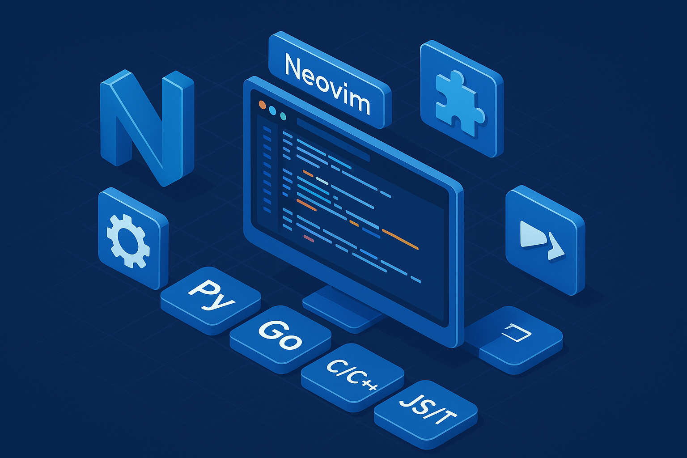

# Neovim Configuration

A modern, well-organized Neovim configuration with comprehensive LSP support, debugging, testing, and an enhanced UI/UX experience.



## Features

- **Plugin Manager**: [lazy.nvim](https://github.com/folke/lazy.nvim) for fast, lazy-loaded plugins
- **Colorscheme**: Catppuccin Frappe with transparent background
- **LSP**: Fully configured Language Server Protocol for Lua, Python, Go, C/C++, TypeScript/JavaScript, and more
- **Completion**: Modern completion engine with [blink.cmp](https://github.com/Saghen/blink.cmp)
- **File Navigation**: Oil.nvim for intuitive file browsing, Telescope for fuzzy finding
- **Git Integration**: Gitsigns for inline diff markers and git operations
- **Debugging**: Full DAP setup with UI for Python, Go, and C/C++ debugging
- **Testing**: Integrated test runners with Neotest (Python & Go)
- **Enhanced UI**: Noice.nvim for prettier messages and LSP documentation

## Requirements

- Neovim >= 0.9.0
- Git
- A [Nerd Font](https://www.nerdfonts.com/) for icons (required for proper icon display)
- [Homebrew](https://brew.sh) (macOS only, for dependency installation)

For all other dependencies (LSP servers, formatters, tools), see the [Dependencies](#dependencies) section below.

## Installation

### Quick Install (macOS)

The easiest way to set up everything at once:

1. **Backup your existing configuration** (if any):

   ```bash
   mv ~/.config/nvim ~/.config/nvim.backup
   mv ~/.local/share/nvim ~/.local/share/nvim.backup
   ```

2. **Clone this repository**:

   ```bash
   git clone https://github.com/orue/config.nvim.git ~/.config/nvim
   ```

3. **Run the installation script**:

   ```bash
   cd ~/.config/nvim
   chmod +x install.sh
   ./install.sh
   ```

   This script will:
   - Install/update Neovim
   - Install all Homebrew dependencies (LSP servers, formatters, tools)
   - Install all npm dependencies (emmet-ls)
   - Prepare Neovim for first launch

4. **Start Neovim**:

   ```bash
   nvim
   ```

   Lazy.nvim will automatically install all plugins on first launch.

### Manual Installation

If you prefer to install dependencies manually, follow the steps in the [Dependencies](#dependencies) section below.

## Dependencies

This configuration requires several external tools for full functionality. On **macOS**, all dependencies can be easily installed using Homebrew.

### Quick Install (macOS) - Option 1: Automated Script

The easiest way to install everything (Neovim + all dependencies) is using the installation script:

```bash
cd ~/.config/nvim
./install.sh
```

This will install Neovim, all Homebrew dependencies, and npm packages automatically.

### Quick Install (macOS) - Option 2: Brewfile Only

If you already have Neovim installed and only need dependencies:

```bash
cd ~/.config/nvim
brew bundle
npm install -g emmet-ls
```

This will install all Homebrew dependencies and npm packages.

### What Gets Installed

#### Core Dependencies

- **node** - JavaScript runtime (needed for some LSP servers)
- **python3** - Python runtime

#### Language Servers

- **lua-language-server** - Lua LSP
- **gopls** - Go LSP
- **pyright** - Python type checking and IntelliSense
- **ruff** - Fast Python linter and formatter
- **typescript-language-server** - TypeScript/JavaScript LSP
- **vue-language-server** - Vue.js LSP (Volar)
- **vscode-langservers-extracted** - HTML, CSS, JSON, ESLint LSP servers
- **marksman** - Markdown LSP
- **dockerfile-language-server** - Dockerfile LSP
- **bash-language-server** - Bash/shell script LSP
- **taplo** - TOML LSP
- **yaml-language-server** - YAML LSP
- **terraform-ls** - Terraform LSP
- **llvm** - Provides clangd (C/C++ LSP) and lldb (C/C++ debugger)

#### Debuggers

- **delve** - Go debugger (dlv)
- **lldb** - C/C++ debugger (included with llvm, no separate install needed)

#### Formatters & Linters

- **prettier** - Multi-language code formatter (JavaScript/TypeScript/Vue/HTML/CSS/JSON/Markdown)
- **ruff** - Fast Python linter and formatter (already listed above)
- **gofumpt** - Stricter Go formatter (install via: `go install mvdan.cc/gofumpt@latest`)
- **goimports** - Go import organizer (install via: `go install golang.org/x/tools/cmd/goimports@latest`)

#### Tools

- **ripgrep** - Fast search tool (required for Telescope)
- **lazygit** - Terminal UI for git commands
- **make** - Build automation tool

#### NPM-based Language Servers

The following language servers are installed via npm (not Homebrew):

```bash
npm install -g emmet-ls
```

**Required packages:**

- **emmet-ls** - Emmet abbreviations for HTML/CSS/JSX/Vue

#### Python Packages (Per-Project)

The following Python packages should be installed **per-project** in a virtual environment, NOT globally:

```bash
# Create a virtual environment
python -m venv .venv

# Activate it
source .venv/bin/activate  # macOS/Linux

# Install packages
pip install debugpy pytest
```

**Required packages:**

- **debugpy** - Python debugger adapter for nvim-dap
- **pytest** - Testing framework for neotest-python

**Why virtual environments?**

- Avoids conflicts between project dependencies
- Keeps system Python clean
- Allows different versions per project
- Better isolation and reproducibility

### Verifying Installation

After installing dependencies, you can verify everything is working:

1. **Check Homebrew packages:**

   ```bash
   brew bundle check --verbose
   ```

2. **Check in Neovim:**
   ```vim
   :checkhealth
   :LspInfo
   ```

### Quick Install (Ubuntu/Debian)

For Ubuntu Server or Debian-based systems, use the comprehensive installation script:

1. **Backup your existing configuration** (if any):

   ```bash
   mv ~/.config/nvim ~/.config/nvim.backup
   mv ~/.local/share/nvim ~/.local/share/nvim.backup
   ```

2. **Clone this repository**:

   ```bash
   git clone https://github.com/orue/config.nvim.git ~/.config/nvim
   ```

3. **Run the installation script**:

   ```bash
   cd ~/.config/nvim
   chmod +x install-ubuntu.sh
   ./install-ubuntu.sh
   ```

   This script will:
   - Install/update Neovim (latest stable via PPA)
   - Install all system dependencies (LSP servers, formatters, tools)
   - Install all npm dependencies
   - Prepare Neovim for first launch

4. **Restart your shell**:

   ```bash
   source ~/.bashrc
   ```

5. **Start Neovim**:

   ```bash
   nvim
   ```

   Lazy.nvim will automatically install all plugins on first launch.

### Other Linux Distributions

For other Linux distributions, refer to the `Brewfile` or `install-ubuntu.sh` for the complete list of required tools and install them using your distribution's package manager.

## Directory Structure

```
~/.config/nvim/
├── init.lua                    # Main entry point
├── lua/
│   ├── config/
│   │   ├── lazy.lua           # Plugin manager setup
│   │   ├── options.lua        # Editor options
│   │   ├── keymaps.lua        # Global keybindings
│   │   └── utils.lua          # Utility functions
│   ├── plugins/               # Plugin configurations
│   │   ├── lsp.lua           # LSP setup
│   │   ├── completion.lua    # Completion engine
│   │   ├── telescope.lua     # Fuzzy finder
│   │   ├── treesitter.lua    # Syntax highlighting
│   │   ├── debug.lua         # DAP debugging
│   │   ├── neotest.lua       # Testing (Python & Go)
│   │   └── ...               # Other plugins
│   └── alpha_custom.lua       # Custom dashboard functions
├── after/
│   └── ftplugin/             # Language-specific settings
│       ├── python.lua        # Python config
│       ├── go.lua            # Go config
│       ├── c.lua             # C/C++ config
│       ├── javascript.lua    # JavaScript config
│       ├── typescript.lua    # TypeScript config
│       ├── javascriptreact.lua  # JSX config
│       ├── typescriptreact.lua  # TSX config
│       ├── vue.lua           # Vue.js config
│       ├── html.lua          # HTML config
│       ├── css.lua           # CSS config
│       └── lua.lua           # Lua config
├── Brewfile                   # macOS dependencies (Homebrew)
├── install.sh                 # Comprehensive installation script (macOS)
├── install-ubuntu.sh          # Ubuntu/Debian installation script
└── README.md
```

## Key Plugins

| Plugin                                                                | Purpose                     |
| --------------------------------------------------------------------- | --------------------------- |
| [catppuccin/nvim](https://github.com/catppuccin/nvim)                 | Colorscheme                 |
| [nvim-treesitter](https://github.com/nvim-treesitter/nvim-treesitter) | Syntax highlighting         |
| [nvim-lspconfig](https://github.com/neovim/nvim-lspconfig)            | LSP configuration           |
| [blink.cmp](https://github.com/Saghen/blink.cmp)                      | Completion engine           |
| [telescope.nvim](https://github.com/nvim-telescope/telescope.nvim)    | Fuzzy finder                |
| [oil.nvim](https://github.com/stevearc/oil.nvim)                      | File explorer               |
| [lualine.nvim](https://github.com/nvim-lualine/lualine.nvim)          | Statusline                  |
| [alpha-nvim](https://github.com/goolord/alpha-nvim)                   | Dashboard                   |
| [flash.nvim](https://github.com/folke/flash.nvim)                     | Fast navigation             |
| [gitsigns.nvim](https://github.com/lewis6991/gitsigns.nvim)           | Git integration             |
| [nvim-dap](https://github.com/mfussenegger/nvim-dap)                  | Debugging                   |
| [neotest](https://github.com/nvim-neotest/neotest)                    | Test runner                 |
| [noice.nvim](https://github.com/folke/noice.nvim)                     | Enhanced UI                 |
| [which-key.nvim](https://github.com/folke/which-key.nvim)             | Keybinding help             |
| [nvim-ts-autotag](https://github.com/windwp/nvim-ts-autotag)          | Auto-close/rename HTML tags |

See the full plugin list in the [lua/plugins/](lua/plugins/) directory.

## Usage

See **[MANUAL.md](MANUAL.md)** for complete documentation including all keybindings, workflows, language-specific features, and troubleshooting.

### Quick Reference

- **Leader key:** `<Space>` (spacebar)
- **Dashboard:** `<Leader>a`
- **File explorer:** `<Space>-`
- **Find files:** `<Space>fd`
- **Git:** `<Leader>gg` (LazyGit)
- **LSP:** `gd` (definition), `gr` (references), `K` (hover)

## Language Support

This configuration provides comprehensive LSP support, debugging, and testing for multiple languages:

- **Python** - Pyright, Ruff formatting/linting, debugpy, pytest, virtual environment auto-detection
- **JavaScript/TypeScript** - ts_ls, inlay hints, Prettier formatting
- **Vue.js** - Volar LSP, template support, component validation, Prettier formatting
- **HTML/CSS** - Auto-close tags, Emmet abbreviations, Prettier formatting
- **Go** - gopls, gofumpt/goimports formatting, Delve debugger, go test integration
- **C/C++** - clangd, lldb debugger, clang-format
- **Lua** - Built-in LSP with Neovim API support

For detailed language-specific features, keybindings, and workflows, see **[MANUAL.md](MANUAL.md)**.

## Customization

### Changing the Colorscheme

Edit `lua/plugins/colorscheme.lua`:

```lua
return {
  "catppuccin/nvim",
  name = "catppuccin",
  config = function()
    require("catppuccin").setup({
      flavour = "frappe",  -- latte, frappe, macchiato, mocha
      transparent_background = true,
    })
    vim.cmd.colorscheme("catppuccin-frappe")
  end,
}
```

### Adding New Plugins

Create a new file in `lua/plugins/` or add to an existing one:

```lua
return {
  "author/plugin-name",
  event = "VeryLazy",  -- Lazy load the plugin
  config = function()
    -- Plugin configuration
  end,
}
```

### Modifying Keybindings

Edit `lua/config/keymaps.lua` or the specific plugin configuration file.

### Language-Specific Settings

Add or modify files in `after/ftplugin/` named `{language}.lua`.

## Troubleshooting

For detailed troubleshooting steps, see the **[MANUAL.md](MANUAL.md)** Troubleshooting section.

### Quick Checks

- **LSP issues:** Run `:LspInfo` and `:checkhealth`
- **Plugin issues:** Run `:Lazy` and press `U` to update
- **Missing dependencies:** Run `brew bundle check --verbose` (macOS)
- **Python issues:** Ensure debugpy and pytest are installed in your virtual environment

## Performance

This configuration is optimized for performance:

- Lazy-loading for most plugins (load only when needed)
- Treesitter disabled for files larger than 100KB
- Async formatting to avoid blocking
- Fast startup time (~50ms on modern hardware)

## Contributing

Feel free to fork this configuration and customize it for your needs. If you find bugs or have suggestions, please open an issue or submit a pull request.

## License

MIT License - Feel free to use and modify this configuration.

## Acknowledgments

This configuration was built using excellent plugins from the Neovim community. Special thanks to:

- [folke](https://github.com/folke) for lazy.nvim, which-key, noice, and flash
- [Catppuccin](https://github.com/catppuccin) for the beautiful colorscheme
- [nvim-lua](https://github.com/nvim-lua) for the foundation of modern Neovim configs
- [nvim-treesitter](https://github.com/nvim-treesitter) for amazing syntax highlighting
- All plugin authors whose work made this configuration possible

## Resources

- [Neovim Documentation](https://neovim.io/doc/)
- [lazy.nvim Documentation](https://lazy.folke.io/)
- [LSP Configuration Guide](https://github.com/neovim/nvim-lspconfig)
- [Telescope Documentation](https://github.com/nvim-telescope/telescope.nvim)
