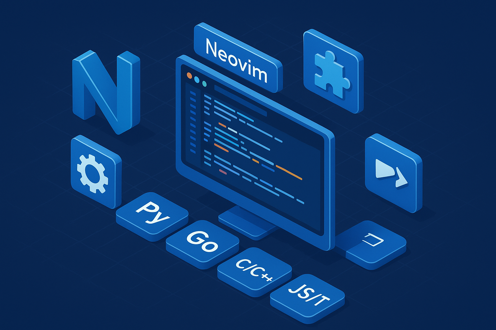

# Neovim Configuration

A Neovim setup with LSP, debugging, testing, and a clean UI. Built on lazy.nvim with Catppuccin Mocha.



## Requirements

- Neovim >= 0.12
- Git
- A [Nerd Font](https://www.nerdfonts.com/) for icons
- [Homebrew](https://brew.sh) (macOS)

## Installation

1. Back up any existing config:

   ```bash
   mv ~/.config/nvim ~/.config/nvim.backup
   mv ~/.local/share/nvim ~/.local/share/nvim.backup
   ```

2. Clone and install:

   ```bash
   git clone https://github.com/orue/config.nvim.git ~/.config/nvim
   cd ~/.config/nvim
   chmod +x install.sh && ./install.sh
   ```

3. Open Neovim. Lazy.nvim installs all plugins on first launch.

If you prefer to install dependencies manually, skip `install.sh` and use the Brewfile:

```bash
brew bundle
npm install -g emmet-ls
```

## Dependencies

### Language servers

| Server | Language |
|--------|----------|
| lua-language-server | Lua |
| pyright | Python (type checking) |
| ruff | Python (linting, formatting) |
| typescript-language-server | TypeScript, JavaScript |
| vue-language-server | Vue.js |
| vscode-langservers-extracted | HTML, CSS, JSON, ESLint |
| dockerfile-language-server | Dockerfile |
| bash-language-server | Bash |
| taplo | TOML |
| yaml-language-server | YAML |
| terraform-ls | Terraform |
| llvm (clangd) | C, C++ |
| emmet-ls (npm) | HTML, CSS, JSX, Vue |

### Formatters and tools

| Tool | Purpose |
|------|---------|
| prettier | JS, TS, Vue, HTML, CSS, JSON, Markdown |
| ruff | Python |
| ripgrep | Fast search (required by Telescope) |
| lazygit | Git TUI |
| make | Build tool |

### Per-project Python packages

Install these in each project's virtual environment, not globally:

```bash
python -m venv .venv
source .venv/bin/activate
pip install debugpy pytest
```

## Directory structure

```
~/.config/nvim/
├── init.lua                    # Entry point
├── lua/
│   ├── config/
│   │   ├── lazy.lua            # Plugin manager bootstrap
│   │   ├── options.lua         # Editor settings
│   │   ├── keymaps.lua         # Global keybindings
│   │   └── utils.lua           # Helpers (venv detection)
│   └── plugins/                # One file per plugin or group
│       ├── lsp.lua
│       ├── completion.lua
│       ├── telescope.lua
│       ├── treesitter.lua
│       ├── debug.lua
│       ├── neotest.lua
│       └── ...
├── after/ftplugin/             # Per-language settings
├── Brewfile                    # macOS dependencies
└── install.sh                  # Automated setup
```

## Plugins

| Plugin | Purpose |
|--------|---------|
| [catppuccin/nvim](https://github.com/catppuccin/nvim) | Colorscheme |
| [nvim-treesitter](https://github.com/nvim-treesitter/nvim-treesitter) | Syntax highlighting |
| [nvim-lspconfig](https://github.com/neovim/nvim-lspconfig) | LSP configuration |
| [blink.cmp](https://github.com/Saghen/blink.cmp) | Completion |
| [telescope.nvim](https://github.com/nvim-telescope/telescope.nvim) | Fuzzy finder |
| [oil.nvim](https://github.com/stevearc/oil.nvim) | File explorer |
| [lualine.nvim](https://github.com/nvim-lualine/lualine.nvim) | Statusline |
| [flash.nvim](https://github.com/folke/flash.nvim) | Fast navigation |
| [gitsigns.nvim](https://github.com/lewis6991/gitsigns.nvim) | Git integration |
| [nvim-dap](https://github.com/mfussenegger/nvim-dap) | Debugging (Python, C/C++) |
| [neotest](https://github.com/nvim-neotest/neotest) | Test runner (Python) |
| [noice.nvim](https://github.com/folke/noice.nvim) | UI enhancements |
| [conform.nvim](https://github.com/stevearc/conform.nvim) | Format on save |

## Quick reference

Leader key is `Space`.

| Key | Action |
|-----|--------|
| `Space -` | File explorer |
| `Space fd` | Find files |
| `Space fg` | Grep across files |
| `Space gg` | LazyGit |
| `gd` | Go to definition |
| `gr` | Go to references |
| `K` | Hover docs |
| `Space ca` | Code actions |
| `Space rn` | Rename symbol |

See [MANUAL.md](MANUAL.md) for all keybindings and workflows. See [KEYBINDINGS.md](KEYBINDINGS.md) for a complete keybinding reference.

## Language support

- **Python** -- Pyright, Ruff, debugpy, pytest, venv auto-detection
- **JavaScript/TypeScript** -- ts_ls, inlay hints, Prettier
- **Vue.js** -- vue_ls, template support, Prettier
- **HTML/CSS** -- Auto-close tags, Emmet, Prettier
- **C/C++** -- clangd, lldb debugger, clang-format
- **Go** -- gopls, goimports
- **Lua** -- lua_ls with Neovim API support

## Troubleshooting

| Problem | What to do |
|---------|------------|
| LSP not working | `:LspInfo`, then `:checkhealth` |
| Plugin issues | `:Lazy`, press `U` to update |
| Missing dependencies | `brew bundle check --verbose` |
| Python features broken | Check venv is active, `pip install debugpy pytest` |
| Format on save broken | `:ConformInfo` to check formatters |

## License

MIT
