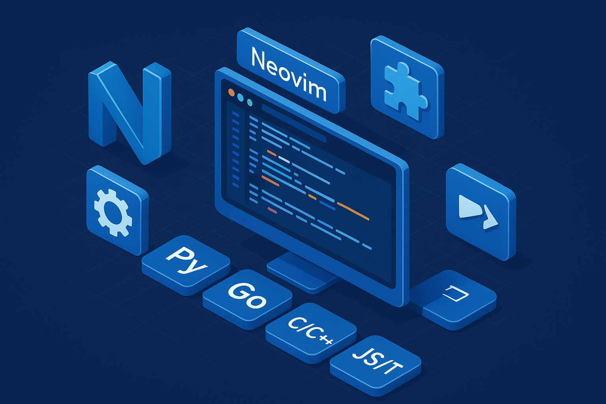

# Neovim Configuration

A Neovim setup with LSP, debugging, testing, and a clean UI. Built on lazy.nvim with Catppuccin Macchiato.



## Requirements

- Neovim >= 0.12
- Git
- A [Nerd Font](https://www.nerdfonts.com/) for icons
- macOS with [Homebrew](https://brew.sh) and the Xcode Command Line Tools (`xcode-select --install`)

## Installation

1. Back up any existing config:

   ```bash
   mv ~/.config/nvim ~/.config/nvim.backup
   mv ~/.local/share/nvim ~/.local/share/nvim.backup
   ```

2. Clone and install:

   ```bash
   git clone https://github.com/orue/config.nvim.git ~/.config/nvim
   ~/.config/nvim/install.sh
   ```

   The script installs Neovim and all dependencies, then lists any tool it can't find. Re-running it is safe: it only resets `~/.local/share/nvim` if you answer yes.

3. Open Neovim. Lazy.nvim installs all plugins on first launch.

If you prefer to install dependencies manually, skip `install.sh` and use the Brewfile:

```bash
brew bundle
npm install -g @olrtg/emmet-language-server
```

## Dependencies

### Language servers

| Server | Language | Source |
|--------|----------|--------|
| lua-language-server | Lua | Homebrew |
| pyright | Python (types) | Homebrew |
| ruff | Python (lint, format) | Homebrew |
| typescript (`tsc --lsp`, TypeScript 7) | JavaScript, TypeScript, React | Homebrew |
| vscode-langservers-extracted | HTML, CSS, JSON, ESLint | Homebrew |
| gopls | Go | Homebrew |
| clangd | C, C++ | Xcode Command Line Tools |
| dockerfile-language-server | Dockerfile | Homebrew |
| bash-language-server | Bash | Homebrew |
| taplo | TOML | Homebrew |
| yaml-language-server | YAML | Homebrew |
| terraform-ls | Terraform | Homebrew |
| emmet-language-server | HTML, CSS, JSX, TSX | npm |

### Formatters, debuggers and tools

| Tool | Purpose |
|------|---------|
| prettier | Formats JS, TS, JSX, TSX, HTML, CSS, JSON, Markdown |
| ruff | Formats Python |
| clang-format | Formats C/C++ |
| goimports | Formats Go |
| shfmt, shellcheck | Shell formatting and linting (through bash-language-server) |
| terraform | `terraform fmt` (through terraform-ls) |
| delve | Go debugger |
| gotestsum | Go test runner (Neotest) |
| lldb-dap | C/C++ debugger (Xcode Command Line Tools) |
| ripgrep | Fast search (Telescope) |
| lazygit | Git TUI |
| tree-sitter-cli | Compiles Treesitter parsers |

### Per-project Python packages

Install these in each project's virtual environment, not globally:

```bash
python -m venv .venv
source .venv/bin/activate
pip install debugpy pytest
```

## Directory structure

```
~/.config/nvim/
├── init.lua                    # Entry point
├── lua/
│   ├── config/
│   │   ├── options.lua         # Editor settings, diagnostics
│   │   ├── keymaps.lua         # Global keybindings
│   │   ├── autocmds.lua        # Global autocommands
│   │   ├── lazy.lua            # Plugin manager bootstrap
│   │   ├── utils.lua           # Python venv detection
│   │   ├── lang.lua            # Helpers for after/ftplugin
│   │   ├── multigrep.lua       # Telescope multi-grep picker
│   │   └── new_project.lua     # Dashboard "new project" action
│   └── plugins/                # One file per plugin or group
│       ├── lsp.lua
│       ├── completion.lua
│       ├── formatter.lua
│       ├── telescope.lua
│       ├── treesitter.lua
│       ├── debug.lua
│       └── ...
├── after/ftplugin/             # Per-language settings and keys
├── Brewfile                    # macOS dependencies
└── install.sh                  # Automated setup
```

## Plugins

| Plugin | Purpose |
|--------|---------|
| [catppuccin/nvim](https://github.com/catppuccin/nvim) | Colorscheme (Macchiato) |
| [nvim-treesitter](https://github.com/nvim-treesitter/nvim-treesitter) | Parsers for syntax highlighting and folding (`main` branch) |
| [nvim-treesitter-textobjects](https://github.com/nvim-treesitter/nvim-treesitter-textobjects) | Function, class and argument text objects (`main` branch) |
| [nvim-lspconfig](https://github.com/neovim/nvim-lspconfig) | Language server defaults |
| [lazydev.nvim](https://github.com/folke/lazydev.nvim) | Neovim Lua API types |
| [blink.cmp](https://github.com/Saghen/blink.cmp) | Completion and signature help |
| [conform.nvim](https://github.com/stevearc/conform.nvim) | Format on save |
| [telescope.nvim](https://github.com/nvim-telescope/telescope.nvim) | Fuzzy finder |
| [oil.nvim](https://github.com/stevearc/oil.nvim) | File explorer |
| [flash.nvim](https://github.com/folke/flash.nvim) | Fast navigation |
| [gitsigns.nvim](https://github.com/lewis6991/gitsigns.nvim) | Git hunks and blame |
| [lazygit.nvim](https://github.com/kdheepak/lazygit.nvim) | LazyGit integration |
| [nvim-dap](https://github.com/mfussenegger/nvim-dap) + [nvim-dap-ui](https://github.com/rcarriga/nvim-dap-ui) | Debugging (Python, C/C++, Go) |
| [neotest](https://github.com/nvim-neotest/neotest) + [neotest-golang](https://github.com/fredrikaverpil/neotest-golang) | Test runner (Python, Go) |
| [persistence.nvim](https://github.com/folke/persistence.nvim) | Save and restore sessions per project |
| [neogen](https://github.com/danymat/neogen) | Docstring generation |
| [claudecode.nvim](https://github.com/coder/claudecode.nvim) | Claude Code integration |
| [lualine.nvim](https://github.com/nvim-lualine/lualine.nvim) | Statusline |
| [bufferline.nvim](https://github.com/akinsho/bufferline.nvim) | Buffer tabs |
| [noice.nvim](https://github.com/folke/noice.nvim) | Command line, messages and notifications UI |
| [alpha-nvim](https://github.com/goolord/alpha-nvim) | Dashboard |
| [which-key.nvim](https://github.com/folke/which-key.nvim) | Keybinding hints |
| [toggleterm.nvim](https://github.com/akinsho/toggleterm.nvim) | Floating terminal |
| [Comment.nvim](https://github.com/numToStr/Comment.nvim) + [nvim-ts-context-commentstring](https://github.com/JoosepAlviste/nvim-ts-context-commentstring) | Commenting (JSX-aware) |
| [nvim-surround](https://github.com/kylechui/nvim-surround) | Surround text objects |
| [nvim-autopairs](https://github.com/windwp/nvim-autopairs) / [nvim-ts-autotag](https://github.com/windwp/nvim-ts-autotag) | Auto-close brackets / HTML and JSX tags |
| [indent-blankline.nvim](https://github.com/lukas-reineke/indent-blankline.nvim) | Indent guides |
| [todo-comments.nvim](https://github.com/folke/todo-comments.nvim) | Highlight and search TODOs |

## Keybindings

Leader key is `Space`; press it and wait to see what's available.

- [MANUAL.md](MANUAL.md) — complete reference: every key, per-language keys, workflows, troubleshooting
- [KEYBINDINGS.md](KEYBINDINGS.md) — VS Code → Neovim transition guide and core Vim editing

Most used:

| Key | Action |
|-----|--------|
| `Space -` | File explorer |
| `Space fd` / `Space fg` | Find files / grep across files |
| `Space gg` | LazyGit |
| `gd` / `grr` / `K` | Definition / references / hover docs |
| `Space ca` / `Space rn` | Code actions / rename |
| `Space ac` | Toggle Claude Code |

## Language support

- **Python** -- Pyright, Ruff (lint, format, imports), debugpy, pytest, per-project venv detection
- **JavaScript/TypeScript/React** -- TypeScript 7 native LSP (`tsc`), ESLint (when the project has a config), inlay hints, Prettier, JSX-aware commenting, Emmet
- **Go** -- gopls, goimports, Delve debugging, Neotest (gotestsum), test/benchmark keys
- **C/C++** -- clangd, lldb-dap debugging, clang-format
- **HTML/CSS** -- Auto-close/rename tags, Emmet, Prettier
- **Lua** -- lua_ls with Neovim API types (lazydev)
- **Bash, Docker, YAML, TOML, Terraform** -- language servers (which also format), Treesitter highlighting
- **Markdown** -- Treesitter highlighting, Prettier, spell check, checkbox keys

Vue is not supported: its tooling needs the older TypeScript server, which TypeScript 7 no longer ships.

## Troubleshooting

| Problem | What to do |
|---------|------------|
| LSP not working | `:checkhealth vim.lsp`, then `:checkhealth` |
| Plugin issues | `:Lazy`, press `U` to update |
| Missing dependencies | `brew bundle check --verbose`, or re-run `./install.sh` to list missing tools |
| Python features broken | Check the venv is active, `pip install debugpy pytest` |
| Format on save broken | `:ConformInfo` to check formatters |

## License

MIT
